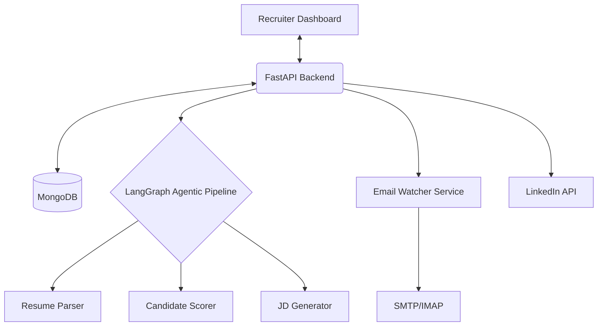

<div align="center">

# 🤖 IARS — Intelligent Agentic Recruitment System
### *The Future of Autonomous Hiring*

[](https://fastapi.tiangolo.com/)
[](https://www.mongodb.com/)
[](https://www.python.org/)
[](https://groq.com/)
[](LICENSE)

---

**IARS** (Intelligent Agentic Recruitment System) is a state-of-the-art, fully automated AI recruitment pipeline. By leveraging multi-agent systems and high-speed LLMs (Llama 3.3 70B via Groq), IARS acts as a 24/7 digital recruiter—monitoring inboxes, parsing resumes, and scoring candidates with unparalleled precision.

[**Explore Docs**](http://localhost:8000/docs) • [**View Demo**](#screenshots) • [**Report Bug**](https://github.com/yourusername/iars/issues)

</div>

---

## 🌟 Key Features

- 🕵️ **Autonomous Email Watcher**: Continuously monitors recruitment inboxes (IMAP) to automatically capture and process incoming CVs every 30 seconds.
- 🧠 **Agentic AI Pipeline**: Utilizes a 7-node LangGraph workflow to perform deep semantic analysis of resumes against dynamic job requirements.
- 📊 **Intelligent Scoring**: Multi-dimensional candidate evaluation (Skills, Experience, Cultural Fit) with interactive ranking charts.
- 📨 **Automated Outreach**: Integrated SMTP system for sending professional, context-aware emails to candidates (Interview invites or polite rejections).
- 📱 **LinkedIn Integration**: Automated job description generation and one-click posting to professional networks.
- ⚡ **Real-time Updates**: Live activity feed and dashboard updates powered by SSE (Server-Sent Events).
- 🎨 **Premium Dashboard**: A sleek, dark-mode administrative interface with glassmorphism aesthetics and real-time funnel visualization.

---

## 🏗️ Architecture

IARS follows a modern decoupled architecture designed for scale and speed:



---

## 🛠️ Technology Stack

| Layer | Technology |
|---|---|
| **Backend** | FastAPI (Python), LangGraph, Groq (Llama 3.3 70B) |
| **Database** | MongoDB |
| **Frontend** | HTML5, CSS3 (Custom Design System), Vanilla JS, Chart.js |
| **DevOps** | Docker, Docker Compose, Makefile |
| **Integrations** | GitHub API, SMTP/IMAP, LinkedIn API |

---

## 🚀 Quick Start

### 1. Prerequisites
- Python 3.10+
- MongoDB 7.0+ (Local or Docker)
- Groq API Key

### 2. Installation
```bash
# Clone the repository
git clone https://github.com/yourusername/iars-fullstack.git
cd iars-fullstack

# Setup Backend
cd backend
pip install -r requirements.txt
cp .env.example .env
# Edit .env and add your GROQ_API_KEY and MONGO_URI
```

### 3. Running with Docker (Recommended)
```bash
make docker-up
```
*Access the API at `http://localhost:8000/docs` and Mongo UI at `http://localhost:8081`.*

### 4. Manual Start
```bash
# Start Backend
uvicorn app.main:app --reload --port 8000

# Open Frontend
# Simply open frontend/dashboard.html in your preferred browser
```

---

## 📡 API Reference

| Method | Endpoint | Function |
|:---:|---|---|
| `GET` | `/api/v1/stats/global` | Global KPIs and chart data |
| `POST` | `/api/v1/jobs/` | Create job + auto-generate JD |
| `POST` | `/api/v1/candidates/score/file` | Upload and AI-score a resume |
| `POST` | `/api/v1/pipeline/run` | Execute full pipeline for a role |
| `GET` | `/api/v1/activity/stream` | SSE real-time activity stream |

---

## 🤝 Contributing

Contributions are welcome! If you have suggestions for new agents or dashboard improvements:
1. Fork the Project
2. Create your Feature Branch (`git checkout -b feature/AmazingFeature`)
3. Commit your Changes (`git commit -m 'Add some AmazingFeature'`)
4. Push to the Branch (`git push origin feature/AmazingFeature`)
5. Open a Pull Request

---

## 📄 License

Distributed under the MIT License. See `LICENSE` for more information.

<div align="center">
  <p>Built with ❤️ by the IARS Team</p>
</div>

